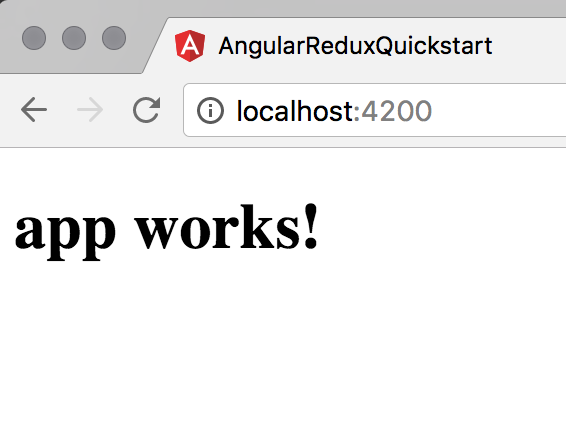
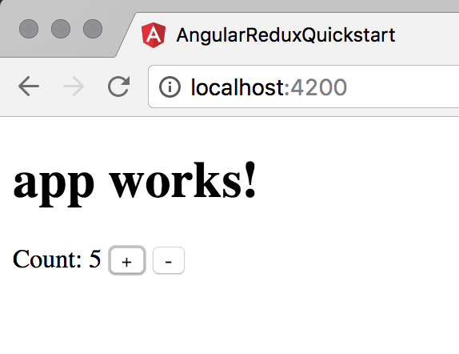
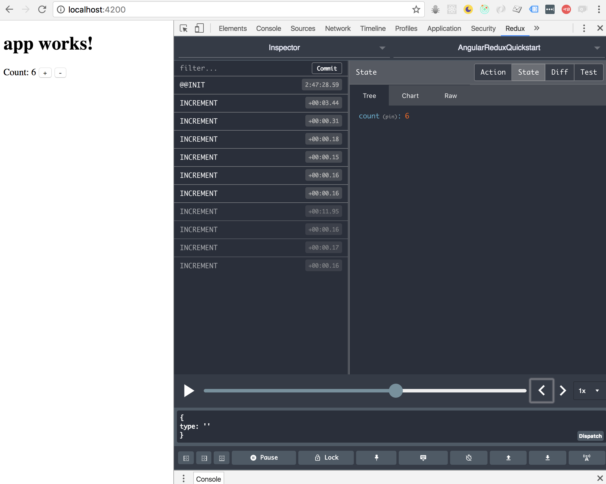

# Beginners' Tutorial

In this tutorial, we'll start from scratch and build a simple counter UI with Angular,
Redux, and @angular-redux/store. I'll try to explain the basic concepts as we go.

## Installation

Let's start by generating a simple Angular application using the
[Angular-CLI](https://github.com/angular/angular-cli).

```sh
# Install Angular CLI
npm install -g @angular/cli

# Use it to spin up a new app.
ng new angular-redux-quickstart
cd angular-redux-quickstart
ng serve
```

You should now be able to see your new Angular app running at http://localhost:4200.



Now let's install Redux into your new app:

```sh
npm install redux @angular-redux/store
```

This installs Redux and `@angular-redux/store` (the Redux bindings for Angular).

## Importing @angular-redux/store into your App.

The first thing we need to do is tell Angular about the new Redux functionality
we just installed. We do that by importing the `NgReduxModule` into our application.

Open up your app's `src/app/app.module.ts` and add the following lines:

`src/app/app.module.ts`:
```typescript
import { BrowserModule } from '@angular/platform-browser';
import { NgModule } from '@angular/core';
import { FormsModule } from '@angular/forms';
import { HttpModule } from '@angular/http';

import { NgReduxModule, NgRedux } from '@angular-redux/store'; // <- New

import { AppComponent } from './app.component';

@NgModule({
  declarations: [
    AppComponent
  ],
  imports: [
    BrowserModule,
    FormsModule,
    HttpModule,
    NgReduxModule, // <- New
  ],
  providers: [],
  bootstrap: [AppComponent]
})
export class AppModule { }
```

This will allow us to inject services from `@angular-redux/store` into our app.

## A Concrete Example

Let's build something in our app. We're going to make a simple piece of UI
that can be used as a counter; it will have two buttons, one for incrementing
a value, and one for decrementing it.

Open up `src/app/app.component.html` and add the following code:

```html
<div>
  Count: {{ count }}
  <button (click)="increment()">+</button>
  <button (click)="decrement()">-</button>
</div>
```

Then open `src/app/app.component.ts` and add some fields:

```typescript
import { Component } from '@angular/core';

@Component({
  selector: 'app-root',
  templateUrl: './app.component.html',
  styleUrls: ['./app.component.css']
})
export class AppComponent {
  title = 'app works!';
  count: number; // <- New

  increment() {} // <- New
  decrement() {} // <- New
}
```


## Modeling the App

Right now, our counter UI does nothing; it's not hooked up to any state or
logic. Let's step back a bit and think about what we need to make this simple
counter work.

### Application State

In order to do its job, the counter component needs to maintain some state:
the current value of the counter. In Redux, we try to avoid keeping application
state in the UI component itself; instead we can keep it in our store. That
way it's easy to find, and it's protected by the immutability guarantees of the
Redux architecture.

So we can define the type of our state as follows:

```typescript
interface IAppState {
  count: number;
}
```

Defining an interface for your store may be overkill for this simple example,
but in larger apps you'll be using `combineReducers` to split your store state
into manageable parts; strong typings will help you keep it all organized.

### Actions

There are two events to which we want our application to respond: clicking the
increment and decrement buttons. We will model these as Redux `action`s.

At any given time, the current value of the count will be modelled as the `reduction`
over the sequence of `INCREMENT` and `DECREMENT` actions that have been triggered.

So we can think of our application conceptually like this:

```js
// Pseudocode
const nextValueOfCount = streamOfActions.reduce(
  (currentValueOfCount, action) => {
    switch(action.type) {
      case 'INCREMENT': return state + 1;
      case 'DECREMENT': return state - 1;
    }

    return state;
  },
  { count: 0 });
```

Great! we've just expressed the essence of what our `rootReducer` needs to be for this
simple, one variable, two-action application.

Let's go ahead and formalize this in our codebase. Create two new files as follows:

`src/app/app.actions.ts`:
```typescript
import { Injectable } from '@angular/core';
import { Action } from 'redux';

@Injectable()
export class CounterActions {
  static INCREMENT = 'INCREMENT';
  static DECREMENT = 'DECREMENT';

  increment(): Action {
    return { type: CounterActions.INCREMENT };
  }

  decrement(): Action {
    return { type: CounterActions.DECREMENT };
  }
}
```

`src/store.ts`:
```typescript
import { Action } from 'redux';
import { CounterActions } from './app/app.actions';

export interface IAppState {
  count: number;
}

export const INITIAL_STATE: IAppState = {
  count: 0,
};

export function rootReducer(lastState: IAppState, action: Action): IAppState {
  switch(action.type) {
    case CounterActions.INCREMENT: return { count: lastState.count + 1 };
    case CounterActions.DECREMENT: return { count: lastState.count - 1 };
  }

  // We don't care about any other actions right now.
  return lastState;
}
```

## Hooking it up to Angular

In Redux, most if not all of your application state is collected into something
called a 'store'. You can think of this as a client-side DB that contains the
current data used by your application: in effect your UI is at any time a pure
function of the current state of your store.

So, let's use the ingredients above to create a Redux store and hook it up to Angular using
`NgRedux.configureStore`.

`src/app/app.module.ts`:
```typescript
// ... imports as above

import { rootReducer, IAppState, INITIAL_STATE } from './store'; // < New
import { CounterActions } from './app.actions'; // <- New

@NgModule({
  declarations: [
    AppComponent
  ],
  imports: [
    BrowserModule,
    FormsModule,
    HttpModule,
    NgReduxModule,
  ],
  providers: [CounterActions], // <- New
  bootstrap: [AppComponent]
})
export class AppModule {
  constructor(ngRedux: NgRedux<IAppState>) {
    // Tell @angular-redux/store about our rootReducer and our initial state.
    // It will use this to create a redux store for us and wire up all the
    // events.
    ngRedux.configureStore(
      rootReducer,
      INITIAL_STATE);
  }
}
```

> Note that if your codebase already has a Redux store set up in non-Angular code, you can register
it with NgRedux using `ngRedux.provideStore` instead of `ngRedux.configureStore`.

## What's a Reducer Anyway?

At its heart, a store in Redux is simply a JavaScript object with some data
in it. However, it is immutable. That means it gets wrapped in an interface
that makes it impossible to simply set fields on it like you would normally do.

Instead, all changes to an application's state are made using one or more 'reducer'
functions.

In effect, we're modeling our application's behaviour as a collection of events
(or `Actions`) over time, combined with an initial state.

Actions typically represent things a user has done; however they can also represent
any event affecting your application from an external source (e.g. data coming in
from the network, etc.).

Each time a new action comes in, the `rootReducer` takes the last state of the
application, considers information provided by the action, and computes the next
state of the store. Once this is done, that new state is broadcasted to the UI,
which recomputes itself from the new state.

If you're familiar with `Array.prototype.reduce`, your application basically
ends up looking conceptually a bit like this:

```typescript
// Pseudocode
const finalAppState:IAppState = actionsOverTime.reduce(
  rootReducer,
  INITIAL_STATE);
```

Or perhaps more usefully:

```typescript
// Pseudocode
const nextState = rootReducer(lastState, mostRecentAction);
UI.render(nextState);
```

## Generating Actions

OK, we've defined our store and hooked it up. However our counter's buttons aren't doing
anything yet. Let's hook that up now.

What we need to do is make those buttons `dispatch` actions to the Redux store. Remember that
we defined `INCREMENT` and `DECREMENT` actions in `src/app/app.actions.ts`. Let's make sure
they are dispatched when the user clicks the buttons:

`src/app/app.component.ts`:
```typescript
// Imports as before.

import { NgRedux } from '@angular-redux/store'; // <- New
import { CounterActions } from './app.actions'; // <- New
import {IAppState} from "../store"; // <- New


@Component({
  selector: 'app-root',
  templateUrl: './app.component.html',
  styleUrls: ['./app.component.css']
})
export class AppComponent {
  title = 'app works!';
  count: number;

  constructor(                           // <- New
    private ngRedux: NgRedux<IAppState>, // <- New
    private actions: CounterActions) {}  // <- New

  increment() {
    this.ngRedux.dispatch(this.actions.increment()); // <- New
  }

  decrement() {
    this.ngRedux.dispatch(this.actions.decrement()); // <- New
  }
}
```

## Displaying State

The last thing we need to do is tell our counter component about the current value of `count`.

We do this by 'selecting' it out of the NgRedux store as an `Observable`. An observable is something
that lets you get the latest value of something that changes over time. Go back to `src/app/app.component.ts`
and `select` the `count` property into your component:

```typescript
// Imports as before.

// Decorator as before
export class AppComponent {
  title = 'app works!';
  count: number;
  subscription; // <- New;

  constructor(
    private ngRedux: NgRedux<IAppState>,
    private actions: CounterActions) {
      this.subscription = ngRedux.select<number>('count') // <- New
        .subscribe(newCount => this.count = newCount);    // <- New
  }

  ngOnDestroy() {                    // <- New
    this.subscription.unsubscribe(); // <- New
  }                                  // <- New

  // Rest of class as before.
}
```

Here, we're listening to a selected observable which will receive the new value of `count` each
time an action happens.  We've also added an `ngOnDestroy` so we can 'un-listen' to those events
when our component is unmounted from the DOM.

At this point your counter should be functional. Try clicking the buttons and see the displayed
number update accordingly.



## But Wait... There's More!

This is the essence of using `NgRedux`. However, one of the benefits of using Observables with Angular
is that Angular has first-class, optimized support for rendering them via a construct called
[async pipe](https://angular.io/articles/ts/latest/api/common/index/AsyncPipe-pipe.html).

Instead of manually subscribing to our selected observable, and then remembering to unsubscribe,
we can use `| async` in our template. This causes Angular to manage the subscription, and also allows
for some optimizations at Angular's change detection level. Less boilerplate and faster too!

Let's give it a try.

```typescript
// Imports as before.

import { Observable } from 'rxjs/Observable';

// Decorator as before
export class AppComponent {
  title = 'app works!';
  readonly count$: Observable<number>; // <- New

  constructor(
    private ngRedux: NgRedux
    private actions: CounterActions) {
      this.count$ = ngRedux.select<number>('count'); // <- New
  }

  // Delete ngOnDestroy: it's no longer needed.
  // Rest of class as before.
}
```

Here, we're saving a reference to the observable itself (`count$: Observable<number>`) instead of to the values it's
being pushed (`count: number`). That `$` on the end is just a convention to let people reading your
code know that this value is an Observable of something, rather than a static value.

We can now throw a `| async` in our template, and Angular will take care of subscribing to `count$` and
unpacking its values as they come in:

`app/app.component.html`:
```html
<!-- As before -->

  Count: {{ count$ | async }} <!-- New -->

<!-- As before -->
```

## But Wait... There's Even More!

`ngRedux.select` is a powerful way to get unfettered access to store Observables; allowing you
to do lots of transformations with RxJS operators to massage the store data in to what more complex
UIs need.  However in this scenario it's overkill: we just want to display the current value of
a property in the store.

For simple cases like this, `@angular-redux/store` exposes a shorthand for selection in the form
of the `@select` decorator. With `@select`, the whole component can be boiled down to the following:

Make the following changes to `src/app/app.component.ts`.

```typescript
import { Component } from '@angular/core';
import { NgRedux, select } from '@angular-redux/store'; // <- Changed
import { CounterActions } from './app.actions';
import { IAppState } from '../store';
import { Observable } from 'rxjs/Observable';

@Component({
  selector: 'app-root',
  templateUrl: './app.component.html',
  styleUrls: ['./app.component.css']
})
export class AppComponent {
  title = 'app works!';
  @select() readonly count$: Observable<number>; // <- Changed

  constructor(
    private actions: CounterActions,
    private ngRedux: NgRedux<IAppState>) {} // <- Changed

  increment() {
    this.ngRedux.dispatch(this.actions.increment());
  }

  decrement() {
    this.ngRedux.dispatch(this.actions.decrement());
  }
}
```

When called with no arguments, `@select` replaces the property it decorates with an Observable
of the store property with the same name as the member variable in question.

You can also specify a name or even a nested store path manually:

```typescript
class MyComponent {
  @select('count') readonly differentVarNameInComponent$: Observable<number>
  @select(['deeply', 'nested', 'store', 'property']) readonly deeplyNested$: Observable<any>;
}
```

> There's actually quite a lot more you can do with `@select` and `ngRedux.select`. Check out the
> [API docs](angular-redux.github.io/store/classes/ngredux.html#select) for more info.

## Unit Testing Selections

Suppose you wanted your unit test your component above. We
expose a mock class that can help you. Just pull
`NgReduxTestingModule` into your Angular `TestBed` configuration:

`my-component.spec.ts`:
```typescript
import { NgReduxTestingModule, MockNgRedux } from '@angular-redux/store/testing';
import { Subject } from 'rxjs/Subject';
import 'rxjs/add/operator/toArray';

import { MyComponent } from './my-component';
import { IAppState } from '../store';

describe('MyComponent', () => {
  beforeEach(() => {
    // Configure your testBed to use NgReduxTestingModule; this test the DI
    // in the test environment to use mock versions of NgRedux and DevToolsExtension.
    TestBed.configureTestingModule({
      declarations: [MyComponent],
      imports: [NgReduxTestingModule],
    }).compileComponents();

    // Reset the mock to start from a clean slate in each unit test.
    MockNgRedux.reset();
  });

  it('Selects the current count value from Redux', done => {
    // Create an instance of MyComponent using Angular's normal unit test features.
    const fixture = TestBed.createComponent(MyComponent);
    const componentUnderTest = fixture.debugElement.componentInstance;
    
    // Get a stub we can use to drive the `@select('count')` observable used by
    // MyComponent (above). This stub will be supplied to any relevant `.select`
    // or `@select` calls used by the component under test by MockNgRedux.
    const countStub: Subject<number> = MockNgRedux.getSelectorStub<IAppState, number>('count');

    // Determine a sequence of values we'd like to test the Redux store with.
    const expectedValues = [ 1, 2, 3, 4, 3, 4, 3, 2, 1];

    // Drive those values through our stub.
    expectedValues.forEach(value => countStub.next(value));

    // Make sure MyComponent's selected count$ variable receives these values.
    componentUnderTest.count$
      .toArray()
      .subscribe(
        actualValues => expect(actualValues).toEqual(expectedValues),
        null,
        done);
  });
```

## Unit Testing Action Dispatches

For testing that actions are dispatched, I prefer to use Jasmine.spy. MockNgRedux will help you
hook into this as well:

```typescript
it('dispatches INCREMENT when ...', () => {
  const spy = spyOn(MockNgRedux.mockInstance, 'dispatch');

  // Run your test code ...

  // Perform your expectations
  expect(spy).toHaveBeenCalledWith({type: CounterActions.INCREMENT });
  // ... etc.
});
```

## The Redux Community

The Redux community has a lot of powerful extensions that can be plugged into your store to
enhance it in different ways. Libraries that let you

* [persist parts of your store to localStorage](https://www.npmjs.com/package/redux-localstorage)
* [handle side-effects and business logic in clean ways](https://www.npmjs.com/package/redux-observable)
* [collect analytics data](https://www.npmjs.com/package/redux-beacon)
* and many more...

These libraries are implemented as [Redux Middleware](http://redux.js.org/docs/advanced/Middleware.html)
or [StoreEnhancers](https://github.com/reactjs/redux/blob/master/docs/Glossary.md#store-enhancer) and
can be connected to NgRedux using the optional 3rd and fourth parameters of `ngRedux.configureStore`.

## Troubleshooting

One of the things that makes Redux's simplified state management model so appealing is that it
allows for some very powerful debugging tools. To try them out on an Angular project, install the
[Redux DevTools chrome extension](https://chrome.google.com/webstore/detail/redux-devtools/lmhkpmbekcpmknklioeibfkpmmfibljd?hl=en).

Then, make a quick adjustment to enable them in your app:

`app/app.module.ts`
```typescript
// Other imports as before
import { NgReduxModule, NgRedux, DevToolsExtension } from '@angular-redux/store'; // <- Changed

@NgModule({
  // Decorator as before
})
export class AppModule {
  constructor(
    ngRedux: NgRedux<IAppState>,
    devTools: DevToolsExtension) { // <- New

    const storeEnhancers = devTools.isEnabled() ? // <- New
      [ devTools.enhancer() ] : // <- New
      []; // <- New

    ngRedux.configureStore(
      rootReducer,
      INITIAL_STATE,
      [], // <- New
      storeEnhancers); // <- New
  }
}
```

Here, we inject a glue class from NgRedux that can tell if the chrome extension is
installed; if so it exposes it as a Redux store enhancer which can be passed to the
last argument of `ngRedux.configureStore`.

When this is done, your Chrome devtools will have a new tab that logs all your actions,
displays your current state, and even allows you to rewind or play forward your application!



## More to Explore

Take a look at https://github.com/angular-redux/example-app for a more complex example, including
Redux integration with Angular's router and forms APIs.

Also check out the [docs](docs) folder for deep-dives into specific subjects people have asked about.
